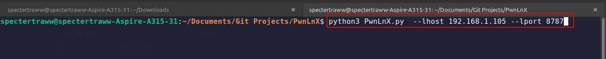
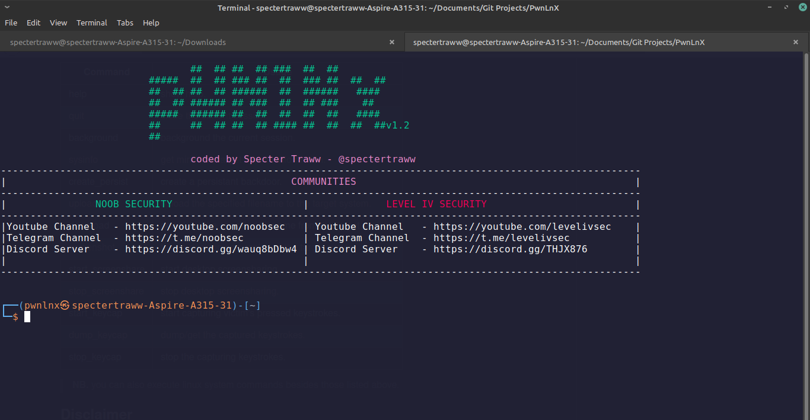
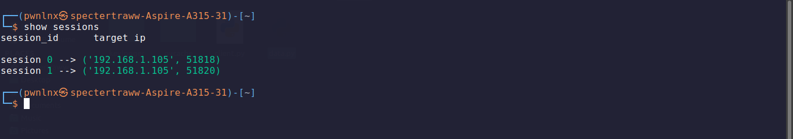
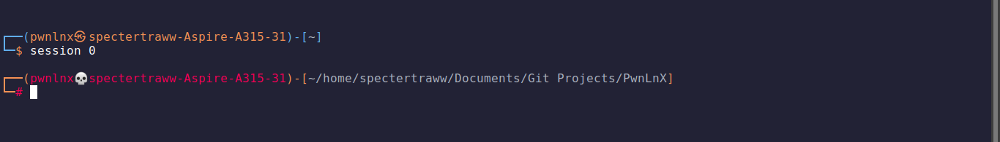
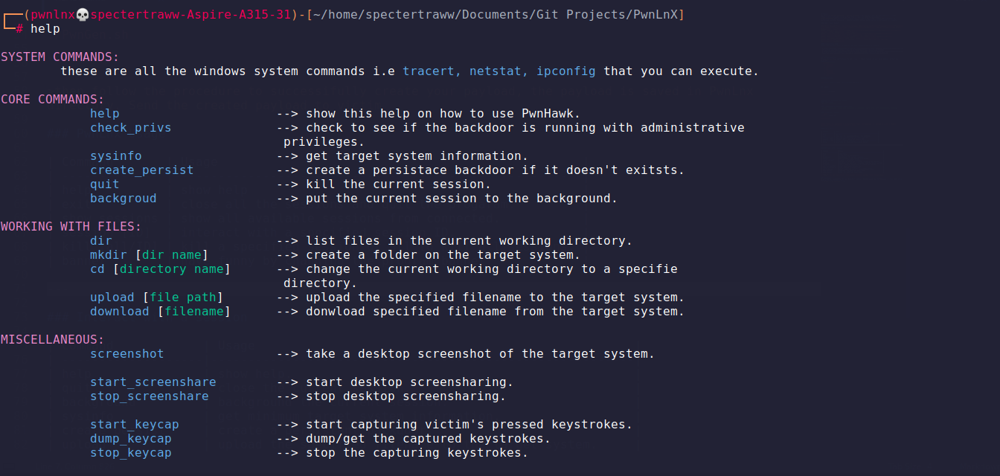
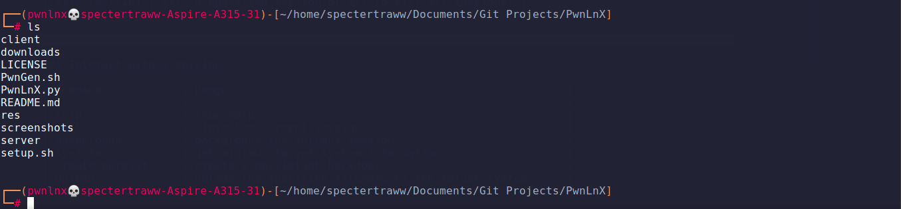
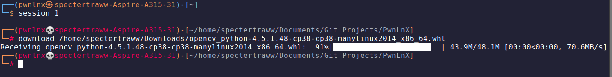

# PwnLnX
An advanced **multi-threaded**, **multi-client** python reverse shell for hacking linux systems. There's still more work to do so feel free to help out with the development.
**Disclaimer**: This reverse shell should only be used in the lawful, remote administration of authorized systems. Accessing a computer network without authorization or permission is illegal.

:mailbox: Reach me out!

[](https://twitter.com/OxTRAW) [](https://twitter.com/xtremepentest)


## Getting Started
Please follow these instructions to get a copy of PwnLnX running on your local machine without any problems.
### Prerequisites
* Python3:
    * vidstream
    * pyfiglet
    * tqdm
    * mss
    * termcolor
    * pyautogui
    * pyinstaller
    * pip3
    * pynput

### Installing
```bash
# Download source code
git clone https://github.com/OxTRAW/PwnLnX.git


cd PwnLnX

# download and  install the dipendences
chmod +x setup.sh

./setup.sh

```

### Getting PwnLnx up and running
#### Show help
`python3 PwnLnX.py --help`

#### Listening for incoming connections
`python3 PwnLnX.py --lhost [your localhost ip address] --lport [free port for listening incoming connections]`

#### creating/Generating a payload
```bash
chmod +x PwnGen.sh

./PwnGen.sh

```

>then follow the procedure to successifully create your payload, the payload is saved in PwnLnx directory. Send the created payload to victim

### PwnLnx Usage

| Command       | Usage                                                 |
| ------------- |-------------------------------------------------------|    					
| help          | show help     					| 
| exit          | close all the sessions and quit the progaram.         |
| show sessions | show all available sessions from connected.           |
| session [ID]  | interact with a specified session ID.                 | 
| kill [all/ID] | kill a specified session or all to kill all sessions. |
| banner        | have funny by changing the program banner             |

---

### Interact with a session

| Command            | Usage                                                   |
| -------------------|---------------------------------------------------------| 
| help               | show help.     					       | 
| quit               | close the current session.                              |
| background         | background the current session.                         |
| sysinfo            | get minimum target system information.                  | 
| create_persist     | create a persistant backdoor.                           |
| upload             | upload the specified filename to the target system.     |
| download           | download the specified filename from the target system. |
| screenshot         | take a desktop screenshot of the target system.         |
| start_screenshare  | start desktop screensharing.                            | 
| stop_screenshare   | stop desktop screensharing.                             |
| start_keycap       | start capturing victim's pressed keystrokes.            |
| dump_keycap        | dump/get the captured keystrokes.                       |
| stop_keycap		 | stop the capturing keystrokes.                          |

> **NB.** you can also execute linux system commands besides those listed above.

## Disclaimer 
I will not be responsible for any direct or indirect damage caused due to the usage of this tool, it is for educational purposes only.
## Report Bugs
> 0xtraw@gmail.com

## Snapshots










# Sponsor this project

**Bitcoin Address**
```
bc1q33ncrxzpuc5n02dc05kl44vpmaw53wf3ztq78q
```
**Etherium Address**
```
0x1c9155bc825CBa45B64741f2E33069d6808AdD92
```
**Litecoin Address**
```
LRvPjCq3ZNunLz3bnSc4wz4FDJF8AZUJLK
```


